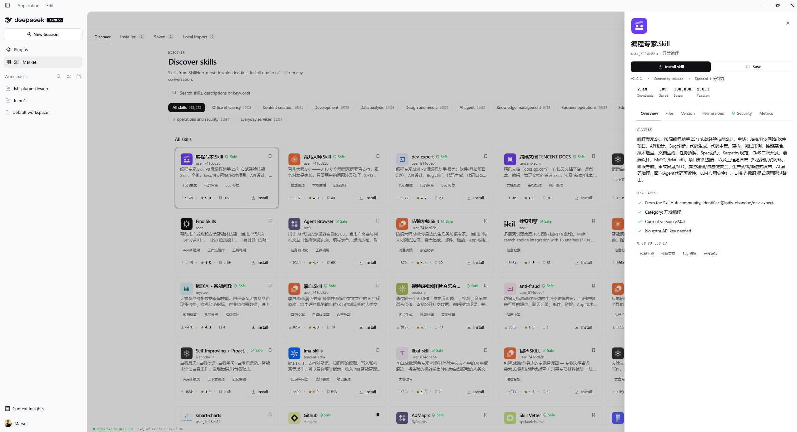
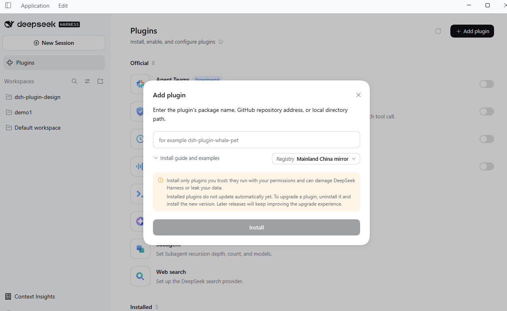

<p align="right">
  <a href="README.md">简体中文</a> · <strong>English</strong>
</p>

<h1 align="center">dsh-skill-market</h1>

<p align="center">
  <strong>A skill market for DeepSeek Harness</strong><br>
  Browse the skills on <a href="https://skillhub.cn/skills?sortBy=score">SkillHub</a> and install them into Harness for real.
</p>

<p align="center">
  <a href="https://github.com/montersy123/dsh-skill-market/stargazers"></a>
  <a href="LICENSE"></a>
  
</p>

<p align="center">
  
</p>

`dsh-skill-market` adds a **Skill Market** panel to the sidebar, turning SkillHub's catalogue into somewhere you can browse, filter, search, inspect — and **install from with one click**. An installed skill is an ordinary local skill: Harness's own skill system discovers it, it sits beside your hand-written skills, and it is callable from any conversation.

> **The skills are not this plugin's work.** Every skill listed comes from [SkillHub](https://skillhub.cn), created and published by its own author. **Copyright belongs to that author**, and each skill is governed by whatever licence it declares. This plugin only makes them easier to find and install from inside Harness.

- **Discover** — the whole SkillHub catalogue, most downloaded first. Category filters, keyword search, lazy loading, and install straight from the card.
- **Installed** — what is on this machine. **Disable without uninstalling** (the directory moves to a parked store, where Harness cannot see it), update, or uninstall.
- **Saved** — a favourites list, kept on this machine only.
- **Local import** — drop in a `.zip` skill package, or copy a directory into the skill root yourself.
- **Details drawer** — six tabs: Overview, Files, Version, Permissions, Security, Metrics. The Files tab expands the real file tree and previews file contents; Version history can install any older release.

## Install

### From the Harness UI (recommended)

Open **DeepSeek Harness → Plugins → Add plugin** and paste this repository's URL:

```text
https://github.com/montersy123/dsh-skill-market
```

Click **Install**. The repository is already runnable ESM — **there is no build step**.

<p align="center">
  
</p>

### With the `dsh` CLI

Pick the profile for the way you run DSH. **Web** is `web`; the **desktop app** is `desktop`:

```sh
# Web
dsh plugin --profile web add github:montersy123/dsh-skill-market

# Desktop app
dsh plugin --profile desktop add github:montersy123/dsh-skill-market
```

`dsh plugin` forwards package management to pnpm, so the only difference between `web` and `desktop` is which
profile the plugin lands in. **Make sure pnpm is on your PATH first.**

Restart that same form afterwards so the new bundle layer takes effect:

```sh
dsh --profile web
```

To confirm the layer really loaded, dump the config before starting — the output should contain
`# == @montersy123/dsh-skill-market`:

```sh
dsh --profile web --dump-config
```

### From a local directory

If you have already cloned the repository, point at the directory instead (same profile names):

```sh
dsh plugin --profile web add ./dsh-skill-market
```

### Updating

An installed plugin does not update itself. Pull the new version and run the install command again — installed
skills, disabled state and favourites are all preserved, because that state lives outside the package.

### Where your data lives

Everything the plugin owns sits in one folder under the profile directory, and nothing is written into DSH's own
storage:

```
<profile>/@montersy123-dsh-skill-market/data/
├── panel.json        favourites (with their full records), the installed ledger, category, restart advice
├── installed.json    which release each skill was installed from
└── skills/           disabled skills, moved here whole so the Harness cannot see them
```

Enabled skills are not in this folder — they live in the Harness's own skill root, `$DSH_HOME/skills`. The
panel's switch moves a directory between the two, so "enabled" is a location, not a flag.

The desktop profile defaults to `%USERPROFILE%\.dsh\profiles\desktop`. To back up or move your settings, copy that
`data` directory; to start clean, delete it (installed skills live separately, under `$DSH_HOME/skills`).

> Older versions kept the panel's state in the page's **Local Storage** — that is, DSH desktop's own
> `%APPDATA%\@deepseek-ai\dsh-desktop\Local Storage`, shared with every other plugin. The first time the panel
> opens after an upgrade it moves that data into `panel.json` and deletes the old keys, so no favourite or ledger
> row is lost.

**Installing a skill requires restarting DeepSeek Harness**: the files land on disk immediately, but a
conversation carries the skill catalogue its agent was built with, so a newly installed skill becomes callable in
**new** conversations. The panel says so in a banner and a toast, and does not block any control while it waits —
change several skills, then restart once.

## Using it

| Where | What you get |
| --- | --- |
| **Discover** | The SkillHub catalogue: category chips carrying each category's **total**, keyword search, and cards showing downloads, rating, saves and the safety mark. |
| **Installed** | Every skill in the library: source, version, directory, file count, install time, plus the enable/disable switch and update/uninstall. |
| **Saved** | A favourites list on this machine, with one-click install. |
| **Local import** | Drop a `.zip`, or place a directory in the skill root — both are listed, and each is marked as which. |
| **Details drawer** | Six tabs. The **Security** tab lists every third-party scanner's verdict individually. |

### The details drawer

Click any card to open it. A statistics strip sits at the top — downloads, saves, score, version — above six tabs. The drawer is the panel on the right in the screenshot at the top of this page.

**Overview** carries the upstream summary and key facts; **Files** expands the real directory tree and previews individual files; **Version** lists each release's notes and can install any older one; **Permissions** separates what the skill declares from what this plugin does; **Metrics** is SkillHub's raw numbers.

### What "Install" actually does

The skill is really downloaded, unpacked and written to `$DSH_HOME/skills/<handle>--<slug>/`. That is **Harness's own** skill root, not a private directory of this plugin — which is exactly why an installed skill becomes an ordinary local skill: the built-in filesystem provider finds it, it sits beside your hand-written skills, and **disabling this plugin does not make it disappear**.

**"Disabled" is a location, not a flag.** Enabling and disabling move the directory between two roots, so where it sits on disk is always the truth. It also means you can do it by hand: copy a folder into `$DSH_HOME/skills` and it is enabled, copy it into the parked store and it is disabled. The panel recognises both.

### Security

SkillHub scans every skill with several third-party scanners. **The panel shows the green "Safe" mark only when every scanner reports safe** — measured, they disagree often, so a single suspicious verdict means no mark at all rather than a grey one. Showing nothing honestly means "no verdict", whereas a grey chip implies the panel has an opinion.

The Security tab lists each scanner's verdict and report link in its own row, so a disagreement is visible instead of being flattened into one conclusion.

## Language

The UI is **bilingual (Chinese and English)**, following DSH's own **Settings → General** language setting; the panel deliberately has no second switch for it. Every string has both languages, and numbers and dates are formatted for the active language.

## Requirements

- DeepSeek Harness with the client plugin tree available (this plugin is a bundle: a `dsh.bundle` manifest plus a `cordis.patch.yml` layer).
- Node.js **>= 20** on the Host side.
- Network access to `api.skillhub.cn` for browsing and installing. Enabling, disabling and uninstalling do not need it.

## Good to know

- **Non-destructive about your data.** Nothing under `$DSH_HOME/skills` or the plugin's `data/` is pruned on startup; disabled and imported skills both survive a restart and a plugin update.
- **Only the destructive direction confirms.** Installing and updating do not prompt; **uninstalling** and **rolling back a version** do — they delete the directory, and undoing it means downloading again.
- **A count is only shown when there is one.** A missing download count is not rendered as `0`: that is what an unmeasured value looks like, and printing it states a fact nobody measured.
- **A package that is itself unusable is refused.** The registry validates the `name` field only when a skill is *loaded*, so a package declaring `name: Something With Spaces` would install quietly and then never appear. It now fails at install time, naming the publisher's mistake.

## Development

The development notes — the design contract, how each behaviour was measured, and the faults found along the way — are in [docs/development.md](docs/development.md) (Chinese); the upstream API notes are in [docs/skillhub-api.md](docs/skillhub-api.md).

The repository carries a self-check suite that needs no browser. After installing the plugin:

```sh
node scripts/install-plugin.mjs --apply   # pack and install into the profile
npm test                                  # the whole suite (29 checks)
```

`npm test` reports each check's exit code, and any failure fails the run. The rest are in [`scripts/`](scripts/),
with one-off investigation scripts archived under [`scripts/dev/`](scripts/dev/).

## Acknowledgements and copyright

Every skill in the panel comes from **[SkillHub](https://skillhub.cn)**. Thanks to the platform's maintainers, and to
each author who publishes there. This plugin only makes those skills easier to find and install from inside Harness.

- **Copyright in each skill belongs to its author**, and each skill is governed by whatever licence it declares (the
  `license` field in its own `SKILL.md`). **This repository's MIT applies to this plugin's own code only, never to
  any skill.**
- **Installing downloads from upstream, at that moment.** This project does not host, mirror, relicense or resell
  any skill content. The `files` whitelist in `package.json` is `lib`, `locale`, `icon.svg`, `cordis.patch.yml`,
  `assets` and the three documents under `docs/`; the captured responses under `tests/` are test data and are never
  published.
- **What this plugin handles is index metadata** — names, descriptions, versions, download and save counts,
  category, third-party security-scan verdicts and file listings — plus the text of an individual file, fetched on
  request when you open it in the preview before installing. It is used only to display and identify skills, and
  links back to the original pages.
- **SkillHub and its marks belong to their respective owners.** This is an independent community project with **no
  affiliation, sponsorship or endorsement** from SkillHub, Tencent or DeepSeek.
- **Whether to trust an installed skill is your decision.** Security-scan verdicts come from SkillHub's third-party
  scanners, are informational, and are not a warranty of any kind; read a skill's own `SKILL.md` before installing.
  The panel shows a green mark only when every scanner reports safe, and that is not a recommendation.
- **If you are a skill author or a platform**, and want what is shown here adjusted or removed, please
  [open an issue](https://github.com/montersy123/dsh-skill-market/issues) and it will be handled promptly.

## License

[MIT](LICENSE) © 2026 montersy123

**That licence covers this plugin's code only, not any skill.** Copyright and licensing of the skills is described
in the section above and in [THIRD-PARTY-NOTICES.md](THIRD-PARTY-NOTICES.md).
