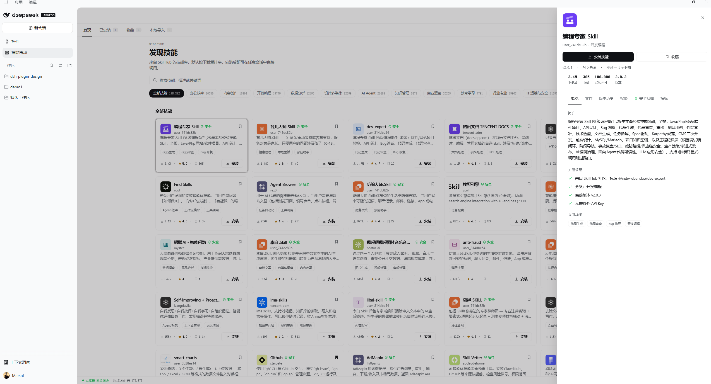
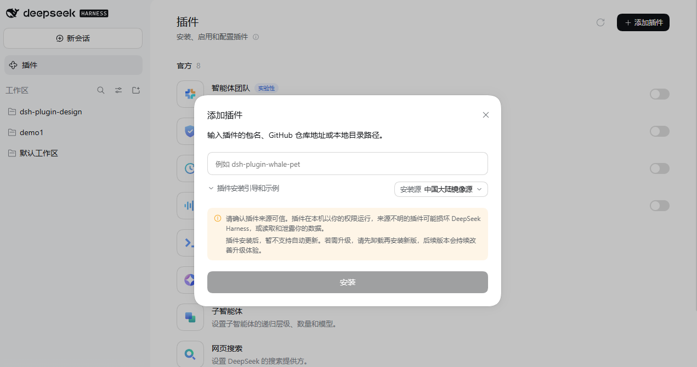

<p align="right">
  <strong>简体中文</strong> · <a href="README.en.md">English</a>
</p>

<h1 align="center">dsh-skill-market</h1>

<p align="center">
  <strong>DeepSeek Harness 的技能市场</strong><br>
  浏览 <a href="https://skillhub.cn/skills?sortBy=score">SkillHub</a> 上的技能,并把它们真的装进 Harness。
</p>

<p align="center">
  <a href="https://github.com/montersy123/dsh-skill-market/stargazers"></a>
  <a href="LICENSE"></a>
  
</p>

<p align="center">
  
</p>

`dsh-skill-market` 在侧边栏加一个 **Skill Market** 面板,把 SkillHub 的技能库变成可以浏览、筛选、搜索、查看详情,并**一键安装到本机**的地方。装好的技能和手写的本地技能没有区别 —— Harness 自己的技能系统会照常发现它们,在任何会话里都能调用。

> **技能不是本插件创作的。** 面板里列出的每一个技能都来自 [SkillHub](https://skillhub.cn),由各自的作者创作并发布,**版权归原作者所有**,以每个技能自己声明的许可证为准。本插件只负责在 Harness 里更省事地找到并安装它们。

- **发现** — 整个 SkillHub 技能库,默认按下载量排序。分类筛选、关键词搜索、懒加载,卡片上直接安装。
- **已安装** — 本机上的技能。可以**停用而不卸载**(目录被移到停用区,Harness 就读不到了),也可以更新或卸载。
- **收藏** — 收藏夹只存在本机,用来记下想装的技能。
- **本地导入** — 把自己手头的 `.zip` 技能包拖进来,或者直接把文件夹拷进技能目录。
- **详情抽屉** — 六个页签:概览、文件、版本历史、权限、安全扫描、指标。文件页签能展开真实的文件树并预览内容,版本历史可以装回任意旧版本。

## 安装

### 从 Harness 界面安装(推荐)

打开 **DeepSeek Harness → 插件 → 添加插件**,粘贴本仓库地址:

```text
https://github.com/montersy123/dsh-skill-market
```

点 **安装**。仓库里的代码就是可运行的 ESM,**不需要任何构建步骤**。

<p align="center">
  
</p>

### 用 `dsh` 命令行安装

按你运行的形态选一个 profile。**桌面端**是 `desktop`,**Web 端**是 `web`:

```sh
# Web 端
dsh plugin --profile web add github:montersy123/dsh-skill-market

# 桌面端
dsh plugin --profile desktop add github:montersy123/dsh-skill-market
```

`dsh plugin` 会把包管理操作转发给 pnpm,所以 `web` 与 `desktop` 的差别只在装进哪个 profile。**先确认 pnpm 在 PATH 上。**

装完**重启对应形态**让新的 bundle 层生效:

```sh
dsh --profile web
```

想确认这一层真的加载了,可以在启动前 dump 一次配置,输出里应当出现 `# == @montersy123/dsh-skill-market`:

```sh
dsh --profile web --dump-config
```

> **为什么从 GitHub 装不会要求你授权构建脚本?** pnpm 默认拒绝运行 git 依赖的构建脚本,所以从源码托管安装的插件通常会要求你在 profile 的 `pnpm-workspace.yaml` 里加 `allowBuilds`。本仓库的 `lib/` 就是最终产物(没有 TypeScript、没有打包步骤、没有 `prepare`),因此不触发这道授权 —— 已实测:直接 `pnpm add github:montersy123/dsh-skill-market` 即可装成。

### 从本地目录安装

已经克隆了仓库的话,直接指向该目录(profile 名同上):

```sh
dsh plugin --profile web add ./dsh-skill-market
```

### 升级

安装的插件不会自动升级。拉取新版本后重新执行安装命令即可 —— 已装的技能、停用状态与收藏都会保留(状态存放在包外)。

**安装技能后需要重启 DeepSeek Harness**:技能文件会立刻落到磁盘,但一场对话用的是它开始时就确定的技能清单,所以新装的技能在**新会话**里才能调用。面板会用一条提示条和一个 toast 说明这一点,并且不会因此锁住任何控件 —— 你可以一次改好几个技能,再重启一次。

## 用它

| 位置 | 能得到什么 |
| --- | --- |
| **发现** | 整个 SkillHub 库:分类 chips 按类目显示**总数**,搜索按关键词命中,卡片显示下载量、评分、收藏数与安全标记。 |
| **已安装** | 库里的每个技能:来源、版本、目录、文件数、安装时间,以及启用/停用开关与更新/卸载。 |
| **收藏** | 只在本机的收藏夹,带一键安装。 |
| **本地导入** | 拖放 `.zip`,或把目录直接放进技能目录 —— 两种都会列出来,并标明是哪一种。 |
| **详情抽屉** | 六个页签。**安全扫描**页签逐个列出第三方检测方的结论。 |

### 详情抽屉

点任意卡片打开。顶部是一条统计条 —— 下载量、收藏数、综合评分、版本 —— 下面是六个页签。上图右侧展开的就是这个抽屉。

**概览**给出上游简介与关键信息;**文件**展开真实的目录树,点开单个文件可以预览内容;**版本历史**列出每个发布的更新说明,并能把任意旧版本装回去;**权限**区分技能自身的声明与本插件的行为;**指标**是 SkillHub 的原始数字。

### 「安装」到底做了什么

技能会被真的下载、解包,写进 `$DSH_HOME/skills/<handle>--<slug>/`。这是 **Harness 自己的**技能根目录,不是插件的私有目录 —— 这正是装好的技能会变成一个普通本地技能的原因:内置的文件系统 provider 会发现它,技能列表里它和手写的技能并列,而且**停用这个插件也不会让它消失**。

**「停用」是一个位置,不是一个标记。** 启用和停用把目录在两个根目录之间移动,所以磁盘上的位置永远就是事实。这也意味着你可以自己动手:把文件夹拷进 `$DSH_HOME/skills` 就是启用,拷进停用区就是停用;面板两种都认。

### 安全扫描

SkillHub 用多家第三方检测方扫描每个技能。**面板只在所有检测方都报告安全时,才显示绿色的「安全」标记** —— 实测中检测方经常互相矛盾,所以只要有一家说可疑,就不显示任何标记(而不是显示一个灰色的)。不显示诚实地表示「没有结论」,而灰色 chip 会让人以为面板有自己的判断。

安全扫描页签逐行列出每家的结论和报告链接,所以分歧是看得见的,而不是被压成一个结论。

## 语言

界面是**中英双语**,跟随 DSH 自己的 **设置 → 常规** 里的语言设置,面板里不再放第二个开关。所有界面文案都有两份,数字和日期按当前语言格式化。

## 环境要求

- DeepSeek Harness,且客户端插件树可用(本插件是一个 bundle:`dsh.bundle` manifest + `cordis.patch.yml` 层)。
- Host 侧 Node.js **>= 20**。
- 访问 `api.skillhub.cn` 的网络。浏览和安装需要它;启用、停用和卸载不需要。

## 说明

- **不会动你的数据。** `$DSH_HOME/skills` 和插件的 `data/` 在启动时都不会被清理;停用的技能和导入的技能在重启与插件升级后都还在。
- **只有破坏性操作才二次确认。** 安装和更新不弹确认,**卸载**和**版本回退**会 —— 它们会删掉目录,要恢复得重新下载。
- **没有数字就不显示数字。** 缺少的下载量不会渲染成 `0`:那是「没测到」的样子,印出来就成了一个没人测过的事实。
- **包本身不合规就拒绝安装。** 注册表只在技能**被加载时**校验 `name` 字段,所以一个声明了 `name: Something With Spaces` 的包会安静地装进去然后永远不出现。现在这种包在安装时就会失败,并指出发布者的错误。

## 开发

开发笔记(设计契约、测量方式、踩过的坑)在 [docs/development.md](docs/development.md);上游接口笔记在 [docs/skillhub-api.md](docs/skillhub-api.md)。

仓库里带一套自检脚本,不需要浏览器就能跑。装了插件之后:

```sh
node scripts/install-plugin.mjs --apply   # 打包并装进 profile
npm test                                  # 整套自检(29 项)
```

`npm test` 会逐项打印退出码,任何一项失败都会让整体失败。其余脚本在 [`scripts/`](scripts/),一次性的调查脚本归档在 [`scripts/dev/`](scripts/dev/)。

## 致谢与版权

面板里的技能**全部来自 [SkillHub](https://skillhub.cn)**。感谢平台的维护者,以及在上面发布技能的每一位作者。本插件只是让你在 Harness 里更方便地找到并安装它们。

- **技能版权归原作者所有**,以每个技能自己声明的许可证(其 `SKILL.md` 中的 `license` 字段)为准。**本仓库的 MIT 只适用于本插件自身的代码,不适用于任何技能。**
- **安装时从上游实时下载。** 本仓库不托管、不镜像、不转授权、不转售任何技能内容。`package.json` 的 `files` 白名单只包含 `lib`、`locale`、`icon.svg`、`cordis.patch.yml`、`assets` 与三份文档;`tests/` 下的响应样本是测试数据,不会随包发布。
- **本插件处理的是索引元数据** —— 名称、简介、版本、下载量、收藏数、分类、第三方安全扫描结论与文件清单,以及你在安装前主动点开某个文件时按需取回的那一份文本。这些只用于展示与识别技能,并附带回原始页面的链接。
- **SkillHub 及其标识归各自所有者所有。** 本插件是独立的社区项目,与 SkillHub、腾讯及 DeepSeek **均无隶属、赞助或背书关系**。
- **安装后的技能由你自己决定是否信任。** 安全扫描结论来自 SkillHub 的第三方检测方,仅供参考,不构成任何担保;安装前请阅读技能自身的 `SKILL.md`。面板只在所有检测方都报告安全时才显示绿色标记,但这不等于推荐。
- **如果你是技能作者或平台方**,希望调整或移除此处展示的信息,请[提交 issue](https://github.com/montersy123/dsh-skill-market/issues),我会尽快处理。

## 许可

[MIT](LICENSE) © 2026 montersy123

**该许可只覆盖本插件的代码,不覆盖任何技能。** 技能的版权与许可归属见上一节,以及 [THIRD-PARTY-NOTICES.md](THIRD-PARTY-NOTICES.md)。
